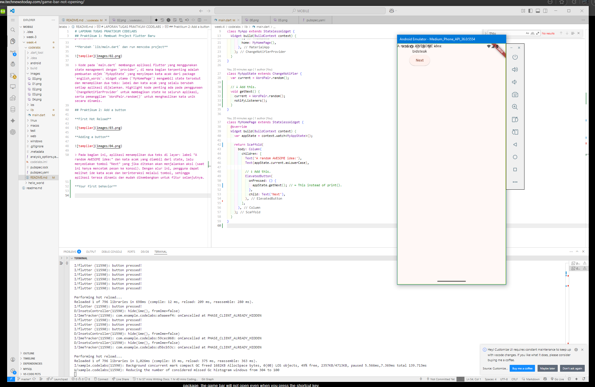
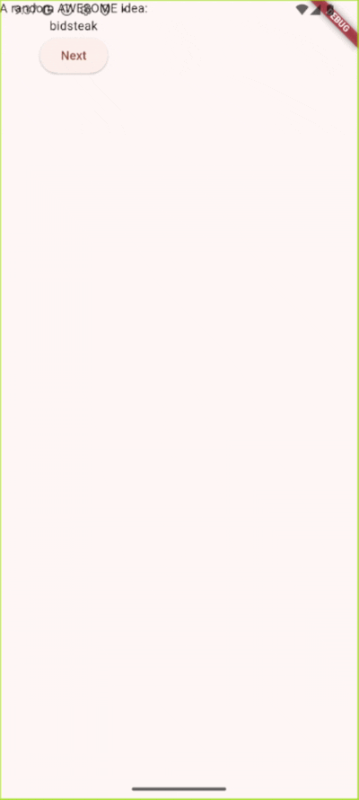
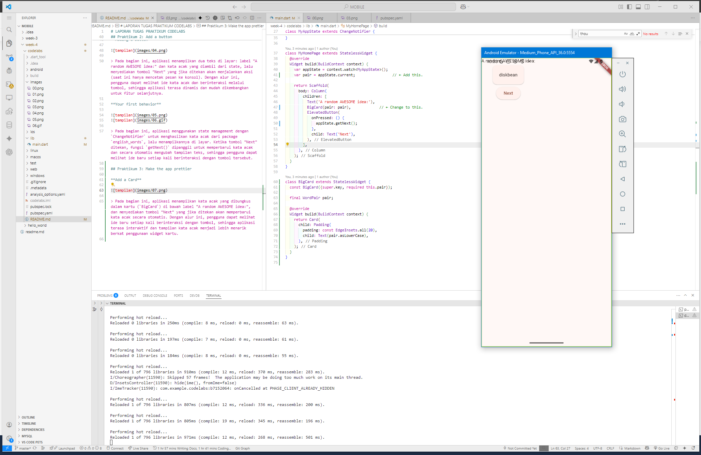
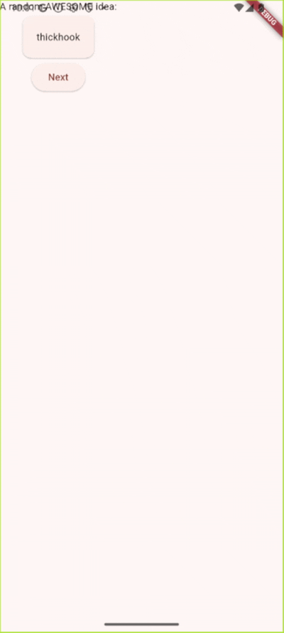
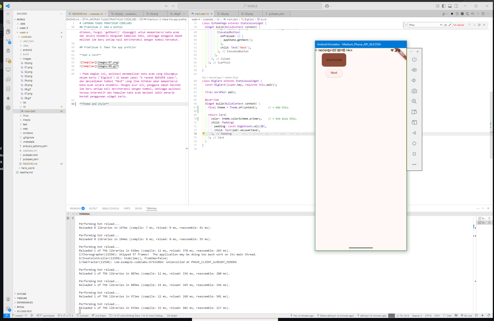

# LAPORAN TUGAS PRAKTIKUM CODELABS

## Praktikum 1: Membuat Project Flutter Baru

Membuat Project Flutter baru memanfaatkan terminal dengan command 
```bash
flutter create hello_world
```


**Merubah `pubspec.yaml`**


> File `pubspec.yaml` berfungsi sebagai konfigurasi utama project Flutter, di mana bagian terpenting adalah daftar dependencies yang menentukan paket-paket yang digunakan dalam aplikasi. Pada project ini, kode menambahkan `provider` untuk manajemen state dan `english_words` untuk menghasilkan kata acak, sehingga aplikasi dapat berjalan dengan fitur interaktif dan dinamis sesuai kebutuhan codelabs. Selain itu, bagian `flutter:` memastikan aplikasi menggunakan material design agar tampilan lebih modern dan konsisten.

**Merubah `analysis_options.yaml`**

```yaml
include: package:flutter_lints/flutter.yaml

linter:
  rules:
    avoid_print: false
    prefer_const_constructors_in_immutables: false
    prefer_const_constructors: false
    prefer_const_literals_to_create_immutables: false
    prefer_final_fields: false
    unnecessary_breaks: true
    use_key_in_widget_constructors: false
```
> File `analysis_options.yaml` digunakan untuk mengatur aturan linter pada project Flutter agar kode yang ditulis lebih konsisten dan mudah dipelihara. Pada bagian terpenting, file ini meng-include standar linter dari `flutter_lints` dan mengatur beberapa aturan khusus, seperti mengizinkan penggunaan `print`, mengatur preferensi penggunaan `const`, serta mengaktifkan atau menonaktifkan beberapa aturan lain sesuai kebutuhan pengembangan. Dengan konfigurasi ini, proses penulisan kode menjadi lebih fleksibel dan sesuai dengan gaya tim atau kebutuhan praktikum.

**Merubah `lib/main.dart` dan run mencoba project**


> Kode pada `main.dart` membangun aplikasi Flutter yang menggunakan state management dengan `provider`, di mana bagian terpenting adalah pembuatan objek `MyAppState` yang menyimpan kata acak dari package `english_words`. Widget utama (`MyHomePage`) mengambil state tersebut dan menampilkan dua teks: label dan kata acak yang selalu berubah setiap aplikasi dijalankan. Highlight kode penting ada pada penggunaan `ChangeNotifierProvider` untuk membagikan state ke seluruh aplikasi, serta pemanggilan `WordPair.random()` untuk menghasilkan kata unik secara dinamis.

## Praktikum 2: Add a button

**First Hot Reload**


**Adding a button**


> Pada bagian ini, aplikasi menampilkan dua teks di layar: label "A random AWESOME idea:" dan kata acak yang diambil dari state, lalu menyediakan tombol "Next" yang jika ditekan akan menjalankan aksi (saat ini hanya mencetak pesan ke konsol). Dengan alur ini, pengguna dapat melihat ide kata acak dan berinteraksi melalui tombol, sehingga aplikasi terasa dinamis dan mudah dikembangkan untuk fitur selanjutnya.

**Your first behavior**




> Pada bagian ini, aplikasi menggunakan state management dengan `ChangeNotifier` untuk menghasilkan kata acak dari package `english_words`, lalu menampilkannya di layar. Ketika tombol "Next" ditekan, fungsi `getNext()` dipanggil untuk memperbarui kata acak dan secara otomatis mengubah tampilan teks, sehingga pengguna dapat melihat ide baru setiap kali berinteraksi dengan tombol tersebut.

## Praktikum 3: Make the app prettier

**Add a Card**




> Pada bagian ini, aplikasi menampilkan kata acak yang dibungkus dalam kartu (`BigCard`) di bawah label "A random AWESOME idea:", dan menyediakan tombol "Next" yang jika ditekan akan memperbarui kata acak secara otomatis. Dengan alur ini, pengguna dapat melihat ide baru setiap kali berinteraksi dengan tombol, sehingga aplikasi terasa interaktif dan tampilan kata acak menjadi lebih menarik berkat penggunaan widget kartu.

**Theme and style**



> Pada bagian ini, widget `BigCard` membungkus kata acak yang dihasilkan dalam sebuah kartu berwarna utama tema aplikasi, dengan padding agar tampilannya lebih menarik dan mudah dibaca. Dengan pendekatan ini, setiap kata acak yang muncul akan selalu ditampilkan secara menonjol dan konsisten mengikuti gaya visual aplikasi.