# LAPORAN JOBSHEET FLUTTER 1

## Praktikum 1: Membuat Project Flutter Baru

Membuat Project Flutter baru memanfaatkan terminal dengan command 
```bash
flutter create hello_world
```
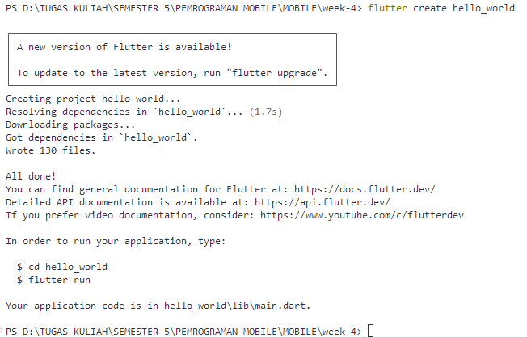

## Praktikum 2: Menghubungkan Perangkat Android atau Emulator

Mengaktifkan proses debug USB

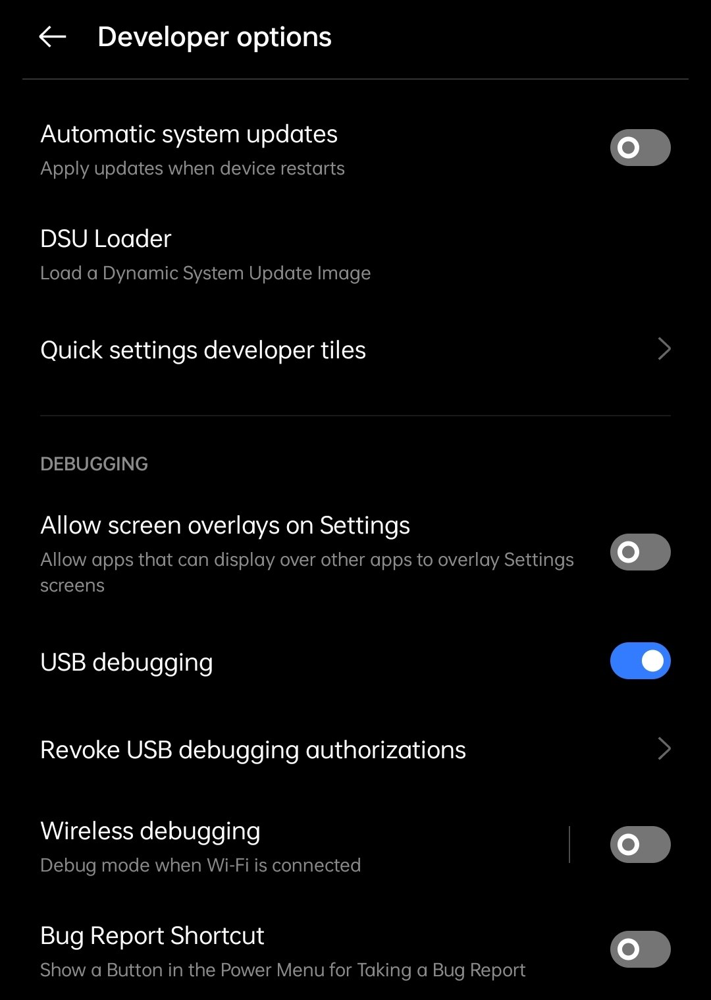

Menginstall Driver USB Google

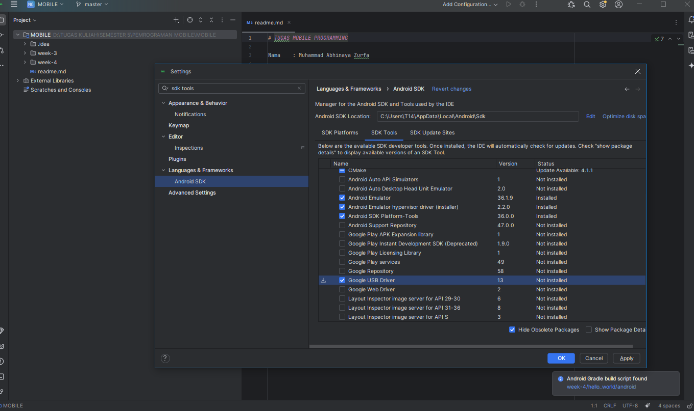

Menjalankan aplikasi di perangkat Android menggunakan kabel


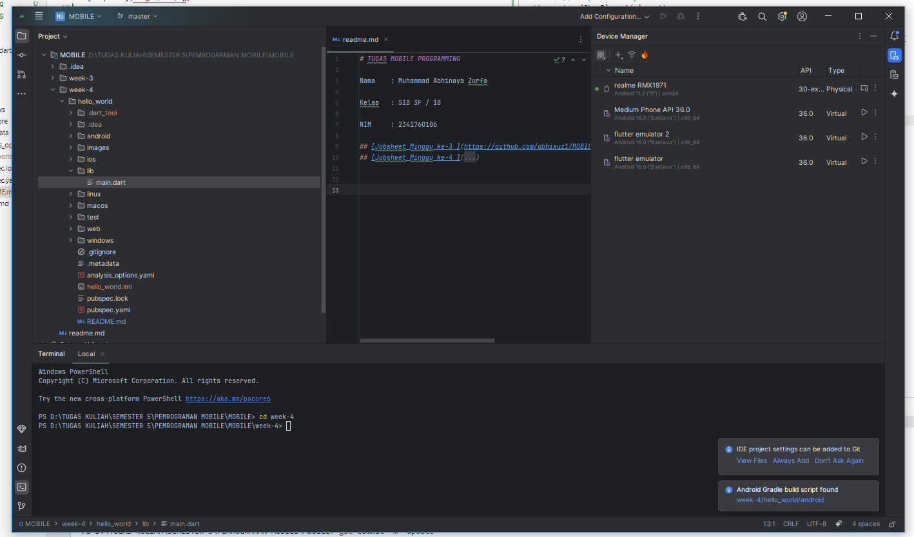

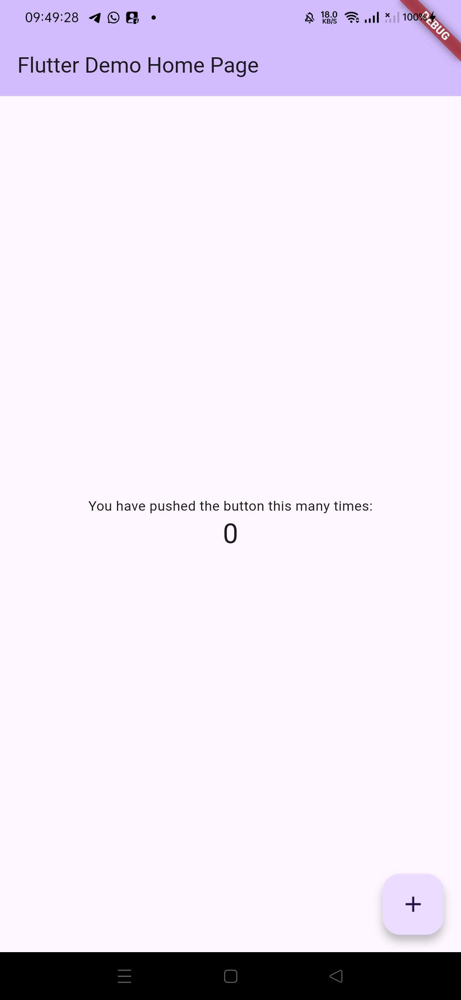

## Praktikum 3: Membuat Repository GitHub dan Laporan Praktikum

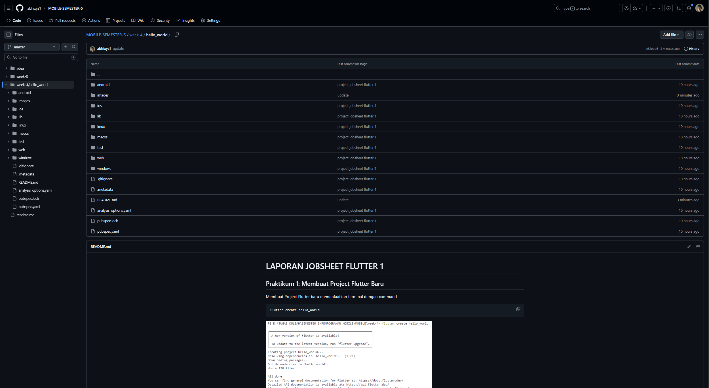

Coba running project hello_world menggunakan emulator / browser / device lain dengan Teks yang ditampilkan dalam aplikasi adalah nama lengkap.

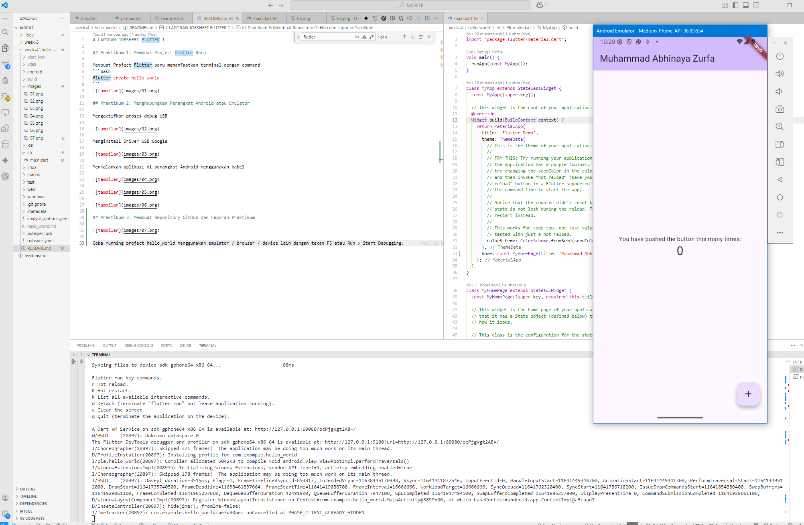

## Praktikum 4: Menerapkan Widget Dasar

**Langkah 1: Text Widget**

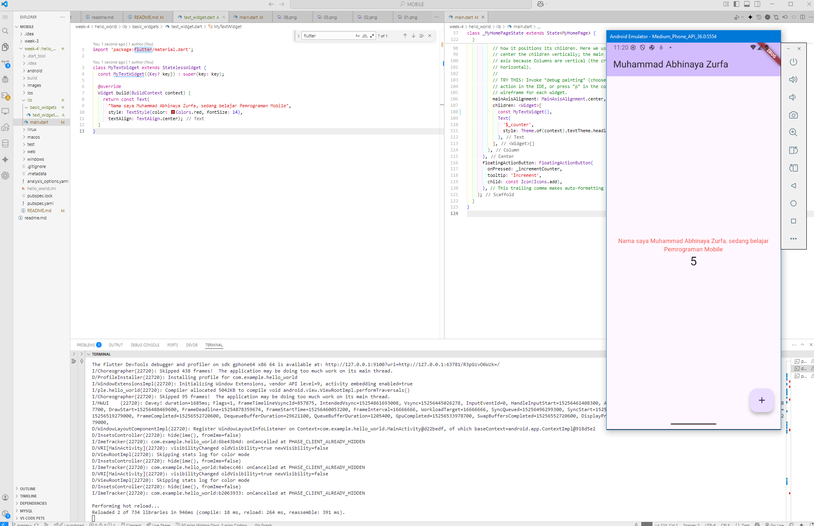

**Langkah 2: Image Widget**

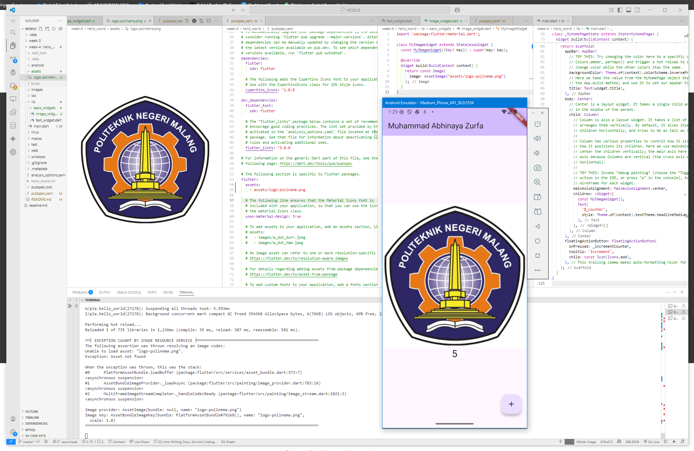

## Praktikum 5: Menerapkan Widget Material Design dan iOS Cupertino


**Langkah 1: Cupertino Button dan Loading Bar**

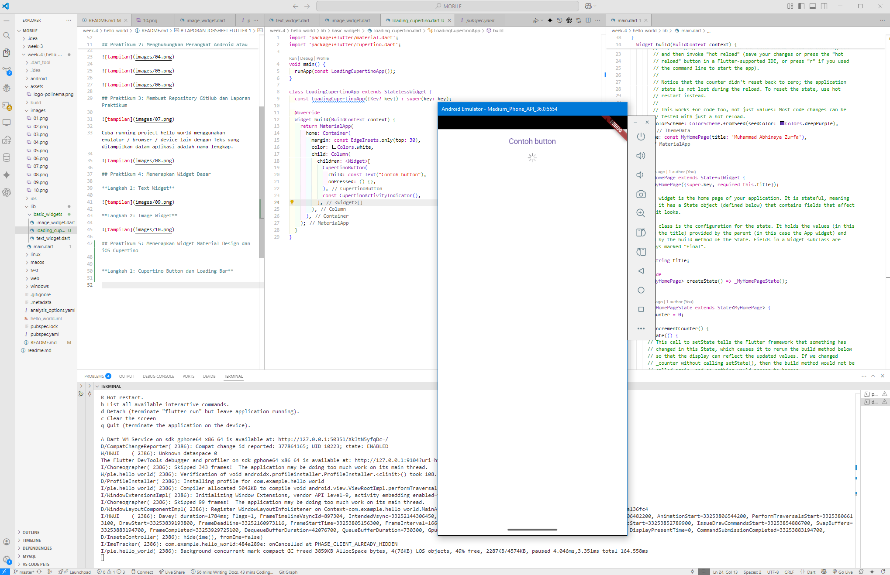
> Kode pada `loading_cupertino.dart` berfungsi untuk menampilkan aplikasi Flutter sederhana yang menggunakan gaya iOS (Cupertino). Di dalamnya, terdapat sebuah tombol bergaya iOS (`CupertinoButton`) dan indikator loading (`CupertinoActivityIndicator`) yang diletakkan secara vertikal di tengah layar dengan latar belakang putih dan margin atas. Kode ini membungkus tampilan tersebut dalam sebuah aplikasi Flutter menggunakan `MaterialApp`, sehingga saat dijalankan, pengguna akan melihat tombol dan loading bar khas iOS di layar aplikasi.

**Langkah 2: Floating Action Button (FAB)**

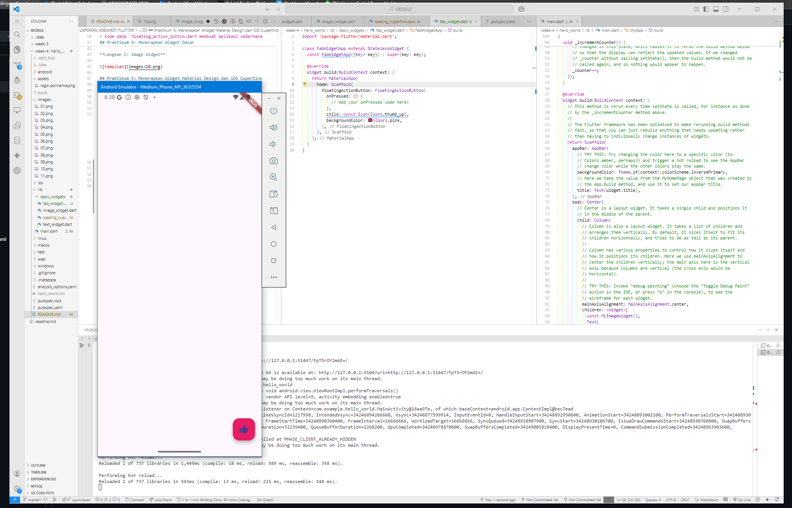
> Kode pada `floating_action_button.dart` membuat aplikasi sederhana yang menampilkan sebuah tombol melayang (`FloatingActionButton`) berikon jempol berwarna pink di pojok kanan bawah yang siap menjalankan aksi saat ditekan (callback `onPressed` saat ini kosong, bisa diisi mis. untuk menampilkan Snackbar atau fungsi lain).

**Langkah 3: Scaffold Widget**

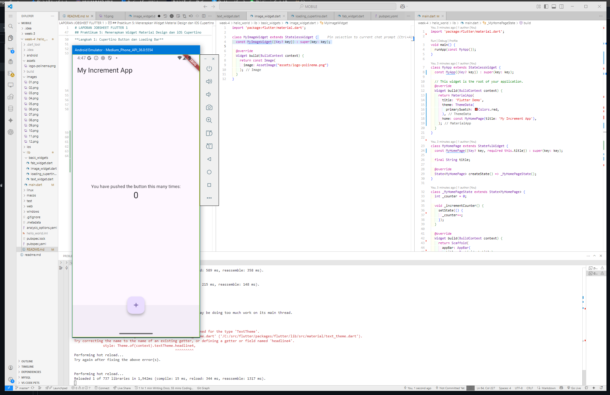

> Kode pada `main.dart` berfungsi sebagai aplikasi Flutter sederhana yang menampilkan angka di tengah layar, di mana setiap kali tombol melayang (FloatingActionButton) berikon tambah ditekan, angka tersebut akan bertambah satu.