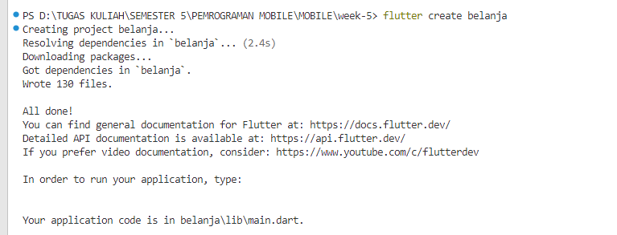
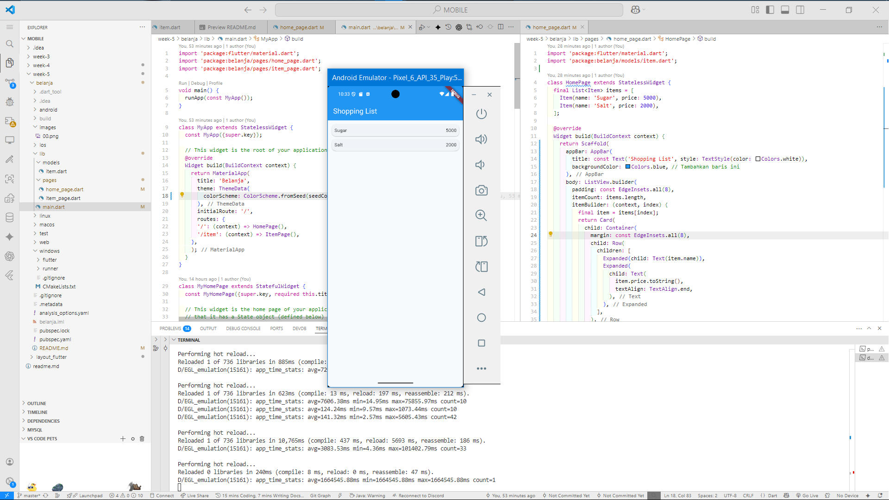
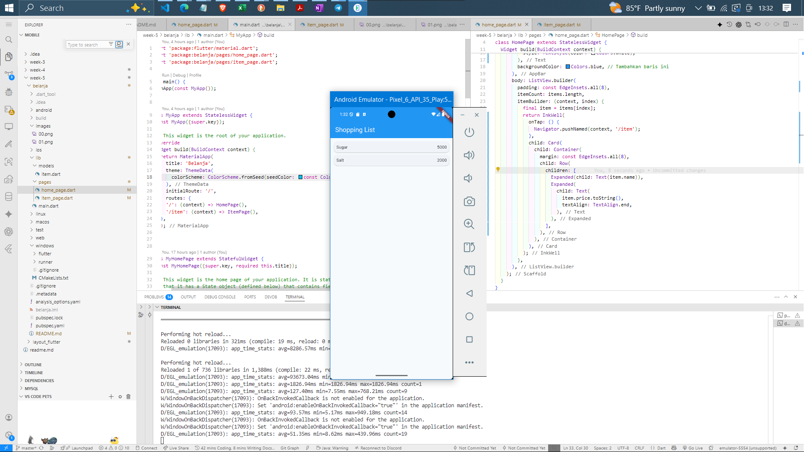
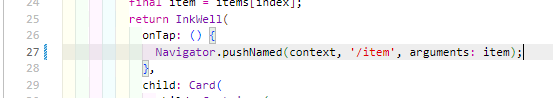

# LAPORAN JOBSHEET FLUTTER 2

## Praktikum 5: Membangun Navigasi di Flutter

**Langkah 1: Buat Project Baru**

Membuat Project Flutter baru memanfaatkan terminal dengan command 
```bash
flutter create belanja
```



**Langkah 2: Mendefinisikan Route**

`home_page.dart` diisi kode
```dart
class HomePage extends StatelessWidget {
  @override
  Widget build(BuildContext context) {
    throw UnimplementedError();
  }
}
```

`item_page.dart` diisi kode
```dart
class ItemPage extends StatelessWidget {
  @override
  Widget build(BuildContext context) {
    throw UnimplementedError();
  }
}
```

**Langkah 3: Lengkapi Kode di main.dart**

Pada `main.dart` tambahkan kode
```dart
void main() {
  runApp(MaterialApp(
    initialRoute: '/',
    routes: {
      '/': (context) => HomePage(),
      '/item': (context) => ItemPage(),
    },
  )); // MaterialApp
}
```

>Untuk mendefinisikan navigasi antar halaman

**Langkah 4: Membuat data model**

Membuat folder baru bernama models dan menambahkan file baru `item.dart`

```dart
class Item {
  String name;
  int price;

  Item({required this.name, required this.price});
}
```

> Class `Item` adalah data model sederhana yang digunakan untuk merepresentasikan sebuah barang dengan dua properti utama, yaitu `name` (nama barang) dan `price` (harga barang). Keduanya bertipe data non-nullable dan wajib diisi melalui konstruktor dengan parameter `required`, sehingga setiap objek `Item` yang dibuat pasti memiliki nama dan harga yang valid sesuai kebutuhan aplikasi.

**Langkah 5: Lengkapi kode di class HomePage**

Pada file `home_page.dart` tambahkan kode

```dart
final List<Item> items = [
    Item(name: 'Sugar', price: 5000),
    Item(name: 'Salt', price: 2000),
  ];
```

> Pada bagian ini, class `HomePage` merupakan widget statis yang berfungsi sebagai halaman utama aplikasi. Di dalamnya terdapat list `items` yang berisi dua objek `Item`, yaitu "Sugar" dengan harga 5000 dan "Salt" dengan harga 2000. List ini dapat digunakan untuk menampilkan data barang pada tampilan aplikasi, sehingga pengguna bisa melihat daftar produk beserta harganya secara langsung di halaman utama.

**Langkah 6: Membuat ListView dan itemBuilder**



> Pada kode ini, halaman utama aplikasi belanja menampilkan daftar barang menggunakan `ListView.builder`, sehingga setiap item seperti "Sugar" dan "Salt" ditampilkan dalam bentuk kartu yang rapi. Judul halaman "Shopping List" muncul di bagian atas dengan latar belakang biru berkat pengaturan `backgroundColor` pada `AppBar`, membuat tampilan lebih menarik dan mudah dikenali oleh pengguna.

**Langkah 7: Menambahkan aksi pada ListView**




## Tugas Praktikum 2
**Menambahkan informasi arguments pada penggunaan Navigator**

