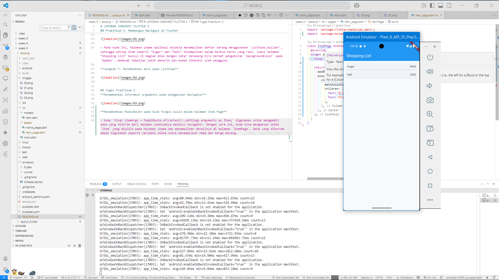
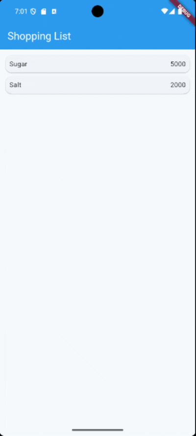
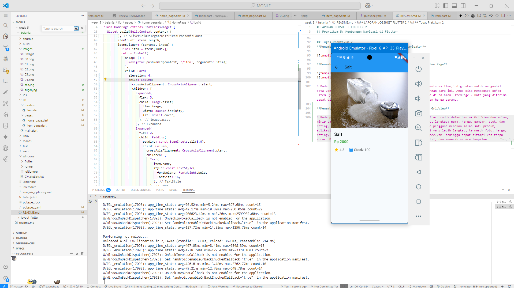
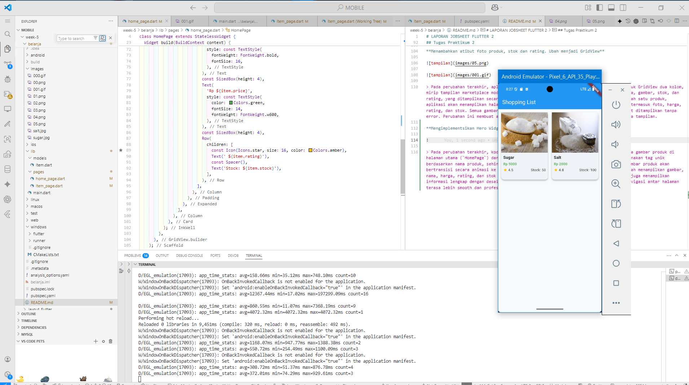
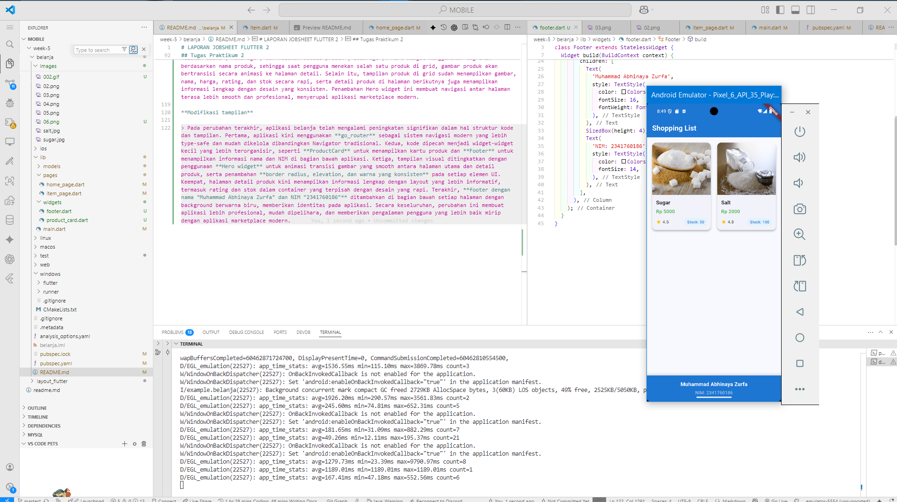
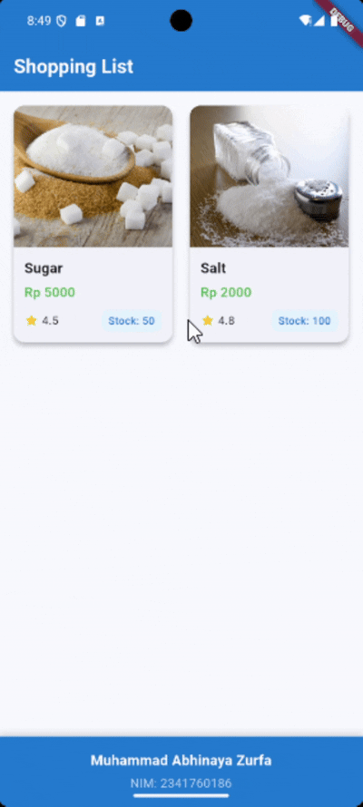

# LAPORAN JOBSHEET FLUTTER 2

## Praktikum 5: Membangun Navigasi di Flutter

**Langkah 1: Buat Project Baru**

Membuat Project Flutter baru memanfaatkan terminal dengan command 
```bash
flutter create belanja
```


**Langkah 2: Mendefinisikan Route**

`home_page.dart` diisi kode
```dart
class HomePage extends StatelessWidget {
  @override
  Widget build(BuildContext context) {
    throw UnimplementedError();
  }
}
```

`item_page.dart` diisi kode
```dart
class ItemPage extends StatelessWidget {
  @override
  Widget build(BuildContext context) {
    throw UnimplementedError();
  }
}
```

**Langkah 3: Lengkapi Kode di main.dart**

Pada `main.dart` tambahkan kode
```dart
void main() {
  runApp(MaterialApp(
    initialRoute: '/',
    routes: {
      '/': (context) => HomePage(),
      '/item': (context) => ItemPage(),
    },
  )); // MaterialApp
}
```

>Untuk mendefinisikan navigasi antar halaman

**Langkah 4: Membuat data model**

Membuat folder baru bernama models dan menambahkan file baru `item.dart`

```dart
class Item {
  String name;
  int price;

  Item({required this.name, required this.price});
}
```

> Class `Item` adalah data model sederhana yang digunakan untuk merepresentasikan sebuah barang dengan dua properti utama, yaitu `name` (nama barang) dan `price` (harga barang). Keduanya bertipe data non-nullable dan wajib diisi melalui konstruktor dengan parameter `required`, sehingga setiap objek `Item` yang dibuat pasti memiliki nama dan harga yang valid sesuai kebutuhan aplikasi.

**Langkah 5: Lengkapi kode di class HomePage**

Pada file `home_page.dart` tambahkan kode

```dart
final List<Item> items = [
    Item(name: 'Sugar', price: 5000),
    Item(name: 'Salt', price: 2000),
  ];
```

> Pada bagian ini, class `HomePage` merupakan widget statis yang berfungsi sebagai halaman utama aplikasi. Di dalamnya terdapat list `items` yang berisi dua objek `Item`, yaitu "Sugar" dengan harga 5000 dan "Salt" dengan harga 2000. List ini dapat digunakan untuk menampilkan data barang pada tampilan aplikasi, sehingga pengguna bisa melihat daftar produk beserta harganya secara langsung di halaman utama.

**Langkah 6: Membuat ListView dan itemBuilder**


> Pada kode ini, halaman utama aplikasi belanja menampilkan daftar barang menggunakan `ListView.builder`, sehingga setiap item seperti "Sugar" dan "Salt" ditampilkan dalam bentuk kartu yang rapi. Judul halaman "Shopping List" muncul di bagian atas dengan latar belakang biru berkat pengaturan `backgroundColor` pada `AppBar`, membuat tampilan lebih menarik dan mudah dikenali oleh pengguna.

**Langkah 7: Menambahkan aksi pada ListView**


## Tugas Praktikum 2
**Menambahkan informasi arguments pada penggunaan Navigator**


**Menambahkan ModalRoute pada blok fungsi build dalam halaman Item Page**




> Kode `final itemArgs = ModalRoute.of(context)!.settings.arguments as Item;` digunakan untuk mengambil data yang dikirim dari halaman sebelumnya melalui navigator. Dengan cara ini, Anda bisa mengakses objek `Item` yang dipilih pada halaman utama dan menampilkan detailnya di halaman `ItemPage`. Data yang diterima dapat digunakan seperti variabel biasa untuk menampilkan nama dan harga barang.

**Menambahkan atibut foto produk, stok dan rating. Ubah menjadi GridView**




> Pada perubahan terakhir, aplikasi belanja kini menampilkan daftar produk dalam bentuk GridView dua kolom, mirip tampilan marketplace modern. Setiap produk memiliki atribut lengkap: nama, harga, gambar, stok, dan rating, yang ditampilkan secara visual pada kartu produk. Ketika pengguna menekan salah satu produk, aplikasi akan menampilkan halaman detail produk dengan informasi yang lebih lengkap, termasuk foto, harga, rating, dan stok. Semua gambar produk sudah didaftarkan di pubspec.yaml sehingga dapat ditampilkan tanpa error. Perubahan ini membuat aplikasi lebih informatif, interaktif, dan menarik secara tampilan.

**Mengimplementsikan Hero Widget**




> Pada perubahan terakhir, kode aplikasi belanja sudah menerapkan **Hero widget** pada gambar produk di halaman utama (`HomePage`) dan halaman detail produk (`ItemPage`). Hero widget menggunakan tag unik berdasarkan nama produk, sehingga saat pengguna menekan salah satu produk di grid, gambar produk akan bertransisi secara animasi ke halaman detail. Selain itu, tampilan produk di grid sudah menampilkan gambar, nama, harga, rating, dan stok secara rapi, serta detail produk di halaman berikutnya juga menampilkan informasi lengkap dengan desain yang konsisten. Penambahan Hero widget ini membuat navigasi antar halaman terasa lebih smooth dan profesional, menyerupai aplikasi marketplace modern.

**Modifikasi tampilan**





> Pada perubahan terakhir, aplikasi belanja telah mengalami peningkatan signifikan dalam hal struktur kode dan tampilan. Pertama, aplikasi kini menggunakan **go_router** sebagai sistem navigasi modern yang lebih type-safe dan mudah dikelola dibandingkan Navigator tradisional. Kedua, kode dipecah menjadi widget-widget kecil yang lebih terorganisir, seperti **ProductCard** untuk menampilkan kartu produk dan **Footer** untuk menampilkan informasi nama dan NIM di bagian bawah aplikasi. Ketiga, tampilan visual ditingkatkan dengan penggunaan **Hero widget** untuk animasi transisi gambar yang smooth antara halaman utama dan detail produk, serta penambahan **border radius, elevation, dan warna yang konsisten** pada setiap elemen UI. Keempat, halaman detail produk kini menampilkan informasi lengkap dengan layout yang lebih informatif, termasuk rating dan stok dalam container yang terpisah dengan desain yang rapi. Terakhir, **footer dengan nama "Muhammad Abhinaya Zurfa" dan NIM "2341760186"** ditambahkan di bagian bawah setiap halaman dengan background berwarna biru, memberikan identitas pada aplikasi. Secara keseluruhan, perubahan ini membuat aplikasi lebih profesional, mudah dipelihara, dan memberikan pengalaman pengguna yang lebih baik mirip dengan aplikasi marketplace modern.