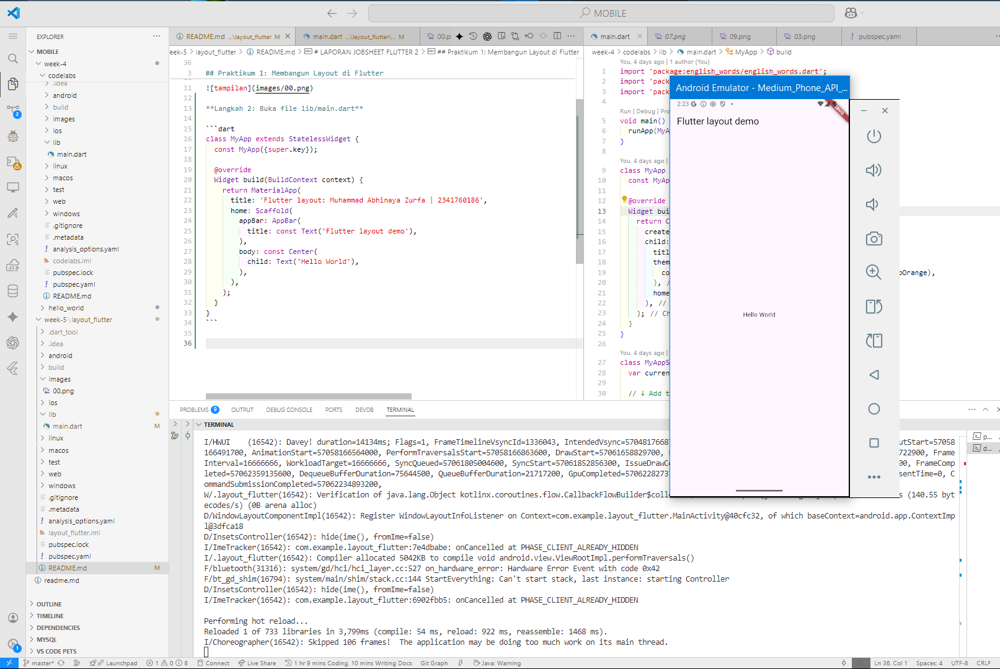

# LAPORAN JOBSHEET FLUTTER 2

## Praktikum 1: Membangun Layout di Flutter

**Langkah 1: Buat Project Baru**
Membuat Project Flutter baru memanfaatkan terminal dengan command 
```bash
flutter create layout_flutter
```


**Langkah 2: Buka file lib/main.dart**

```dart
class MyApp extends StatelessWidget {
  const MyApp({super.key});

  @override
  Widget build(BuildContext context) {
    return MaterialApp(
      title: 'Flutter layout: Muhammad Abhinaya Zurfa | 2341760186',
      home: Scaffold(
        appBar: AppBar(
          title: const Text('Flutter layout demo'),
        ),
        body: const Center(
          child: Text('Hello World'),
        ),
      ),
    );
  }
}
```



