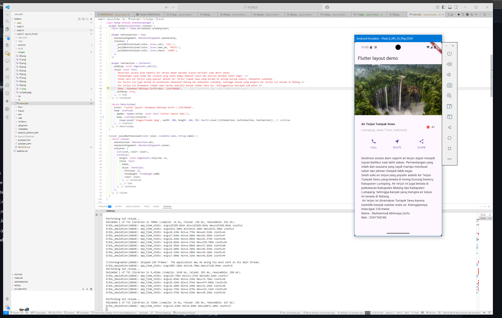

# LAPORAN JOBSHEET FLUTTER 2

## Praktikum 1: Membangun Layout di Flutter

**Langkah 1: Buat Project Baru**
Membuat Project Flutter baru memanfaatkan terminal dengan command 
```bash
flutter create layout_flutter
```


**Langkah 2: Buka file lib/main.dart**

```dart
class MyApp extends StatelessWidget {
  const MyApp({super.key});

  @override
  Widget build(BuildContext context) {
    return MaterialApp(
      title: 'Flutter layout: Muhammad Abhinaya Zurfa | 2341760186',
      home: Scaffold(
        appBar: AppBar(
          title: const Text('Flutter layout demo'),
        ),
        body: const Center(
          child: Text('Hello World'),
        ),
      ),
    );
  }
}
```


**Langkah 4: Implementasi title row**


> Pada bagian ini, kode membangun layout horizontal berisi informasi wisata dengan tiga poin utama:  
> **(1)** Mengatur posisi teks judul dan subjudul ke kiri menggunakan `crossAxisAlignment: CrossAxisAlignment.start` pada widget `Column`,  
> **(2)** Memberikan jarak bawah pada judul dan menampilkan subjudul dengan warna abu-abu agar tampilan lebih rapi dan informatif,  
> **(3)** Menambahkan ikon bintang berwarna merah dan angka "41" di sebelah kanan untuk menunjukkan rating atau jumlah favorit, sehingga keseluruhan tampilan menjadi lebih menarik dan mudah dipahami oleh pengguna.

## Praktikum 2: Implementasi button row

**Langkah 1: Buat method Column _buildButtonColumn**


> Fungsi `_buildButtonColumn` digunakan untuk membuat tombol vertikal yang terdiri dari ikon dan label di bawahnya, dengan warna dan ikon yang bisa disesuaikan. Setiap tombol memiliki jarak antar label dan ikon, serta desain yang konsisten, sehingga saat dipanggil di layout aplikasi, baris tombol akan tampil rapi dan mudah diakses oleh pengguna untuk berbagai aksi seperti call, route, atau share.

**Langkah 2: Buat widget buttonSection**


> Widget `buttonSection` berfungsi untuk menampilkan tiga tombol aksi secara horizontal dan sejajar, masing-masing dengan ikon dan label berbeda (CALL, ROUTE, SHARE), serta warna yang konsisten dengan tema aplikasi. Dengan penataan menggunakan `mainAxisAlignment: spaceEvenly`, setiap tombol memiliki jarak yang sama sehingga tampilan baris tombol menjadi rapi, mudah diakses, dan memperkuat interaksi pengguna pada aplikasi.

**Langkah 3: Tambah button section ke body**


> Pada file `main.dart` terbaru, aplikasi Flutter menampilkan layout wisata dengan judul, lokasi, ikon bintang merah, dan angka rating secara horizontal di bagian atas, diikuti baris tiga tombol aksi (CALL, ROUTE, SHARE) yang tersusun rapi dan sejajar. Seluruh tampilan ini dibangun menggunakan kombinasi widget `Row`, `Column`, dan `Expanded` agar responsif dan mudah dibaca. Selain itu, terdapat halaman lain yang menampilkan fitur counter sederhana, di mana pengguna dapat menambah angka dengan menekan tombol tambah di kanan bawah. Dengan struktur ini, aplikasi terasa interaktif, informatif, dan desainnya konsisten mengikuti standar Flutter modern.

## Praktikum 3: Implementasi text section
**Langkah 1: Buat widget textSection**


**Langkah 2: Tambahkan variabel text section ke body**


## Praktikum 4: Implementasi image section

**Langkah 1: Siapkan aset gambar**


Pada `pubspec.yaml` menambahkan kode :

```yaml
flutter:
  assets:
    - images/tumpak.jpeg
```

**Langkah 2: Tambahkan gambar ke body**

Pada `main.dart` menambahkan :
```dart
Column(children: [
          Image.asset('images/tumpak.jpeg', width: 500, height: 240, fit: BoxFit.cover),titleSection, buttonSection, textSection])
```


**Langkah 3: Terakhir, ubah menjadi ListView**



> Pada bagian ini, aplikasi Flutter menampilkan halaman utama dengan AppBar berjudul "Flutter layout demo" dan isi berupa gambar destinasi wisata, baris judul yang informatif, tiga tombol aksi yang tersusun rapi, serta deskripsi lengkap tentang Air Terjun Tumpak Sewu. Semua elemen ditata menggunakan `ListView` agar tampilan dapat di-scroll dengan nyaman, sehingga pengguna bisa menikmati informasi dan fitur aplikasi secara lebih interaktif dan responsif.


##  Praktikum 5: Membangun Navigasi di Flutter
[Klik Disini](https://github.com/abhixyz1/MOBILE-SEMESTER-5/tree/master/week-5/belanja)