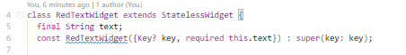
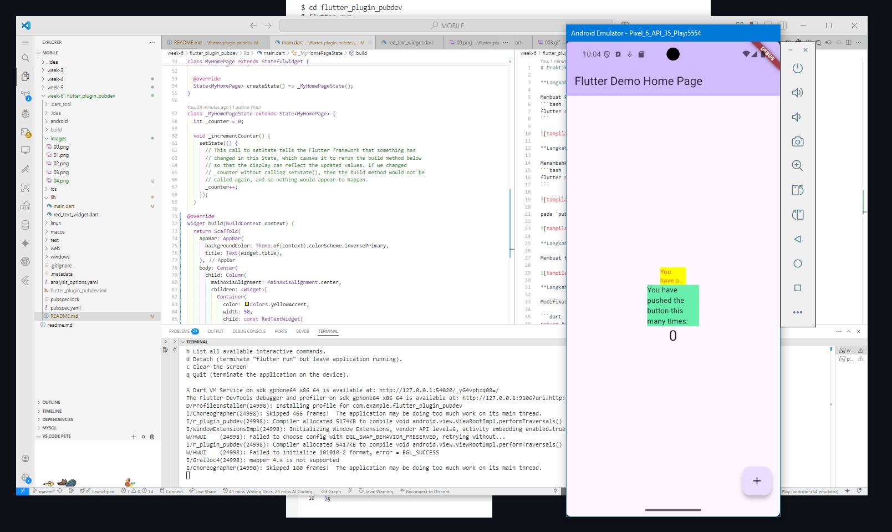

# Praktikum Menerapkan Plugin di Project Flutter

**Langkah 1: Buat Project Baru**

Membuat Project Flutter baru memanfaatkan terminal dengan command 
```bash
flutter create  flutter_plugin_pubdev
```


**Langkah 2: Menambahkan Plugin**

Menambahkan plugin
```bash
flutter pub add auto_size_text
```


pada `pubspec.yaml` berubah kodenya menjadi


**Langkah 3: Buat file red_text_widget.dart**

Membuat file baru bernama `red_text_widget.dart`


**Langkah 4: Tambah Widget AutoSizeText**

Modifikasi pada `red_text_widget.dart`

```dart
return AutoSizeText(
      text,
      style: const TextStyle(color: Colors.red, fontSize: 14),
      maxLines: 2,
      overflow: TextOverflow.ellipsis,
);
```

**Langkah 5: Buat Variabel text dan parameter di constructor**



**Langkah 6: Tambahkan widget di main.dart**



> Pada perubahan terakhir, telah mencoba membuat custom widget bernama **RedTextWidget** yang memanfaatkan plugin `auto_size_text` dari pub.dev. Widget ini digunakan untuk menampilkan teks berwarna merah yang otomatis menyesuaikan ukuran font agar tetap muat dalam dua baris, dengan overflow berupa ellipsis jika terlalu panjang. RedTextWidget kemudian digunakan di halaman utama aplikasi, berdampingan dengan widget `Text` biasa, sehingga pengguna dapat membandingkan tampilan dan perilaku keduanya. Selain itu, struktur kode tetap mengikuti pola Flutter standar dengan penggunaan `StatefulWidget` untuk counter dan penempatan widget custom di dalam widget tree. Perubahan ini membuat aplikasi lebih modular, mudah dikembangkan, dan memperlihatkan pemanfaatan plugin eksternal untuk kebutuhan UI khusus.