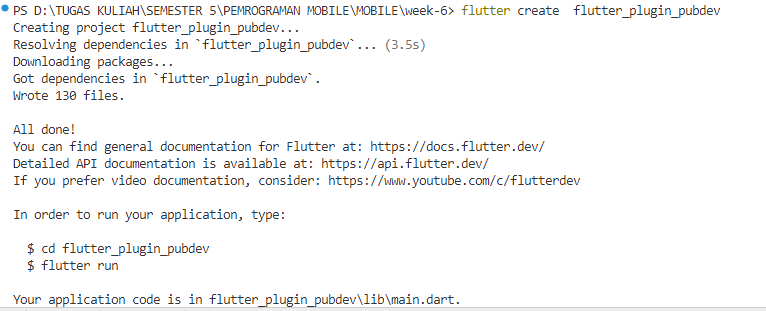
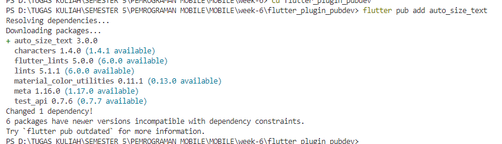
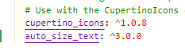
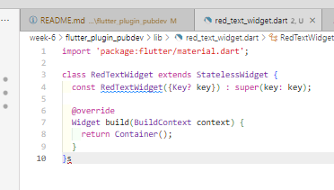

# Praktikum Menerapkan Plugin di Project Flutter

**Langkah 1: Buat Project Baru**

Membuat Project Flutter baru memanfaatkan terminal dengan command 
```bash
flutter create  flutter_plugin_pubdev
```



**Langkah 2: Menambahkan Plugin**

Menambahkan plugin
```bash
flutter pub add auto_size_text
```



pada `pubspec.yaml` berubah kodenya menjadi



**Langkah 3: Buat file red_text_widget.dart**

Membuat file baru bernama `red_text_widget.dart`

