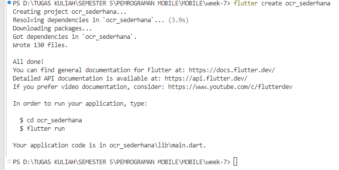

# Praktikum APLIKASI OCR SEDERHANA DENGAN FLUTTER

**Langkah 1: Buat Project Baru**

Membuat Project Flutter baru memanfaatkan terminal dengan command 
```bash
flutter create ocr_sederhana
```



**Langkah 2: Menambahkan Plugin**

Menambahkan kode pada `pubspec.yaml`
```yaml
  google _ mlkit _ text _ recognition : ˆ0.10.0
  camera : ˆ0.10.5+5
  path _ provider : ˆ2.1.2
  path : ˆ1.8.3
  ```

dan jalankan
```bash
flutter pub get
````

**Langkah 3: Tambahkan Izin Kamera (Android)**

pada `AndroidManifest.xml`
```xml
<uses - permission android:name =" android . permission . CAMERA " />
```