# Praktikum APLIKASI OCR SEDERHANA DENGAN FLUTTER

**Langkah 1: Buat Project Baru**

Membuat Project Flutter baru memanfaatkan terminal dengan command 
```bash
flutter create ocr_sederhana
```


**Langkah 2: Menambahkan Plugin**

Menambahkan kode pada `pubspec.yaml`
```yaml
  google _ mlkit _ text _ recognition : ˆ0.10.0
  camera : ˆ0.10.5+5
  path _ provider : ˆ2.1.2
  path : ˆ1.8.3
  ```

dan jalankan
```bash
flutter pub get
````


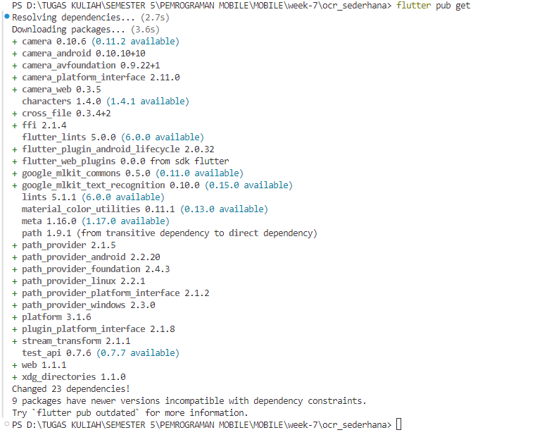

**Langkah 3: Tambahkan Izin Kamera (Android)**

pada `AndroidManifest.xml`
```xml
<uses - permission android:name =" android . permission . CAMERA " />
```

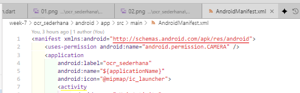

**Langkah 4: Buat Struktur Folder**

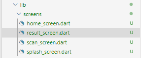

**Langkah 5: Kode Program**

Menambahkan kode pada File `lib/main.dart`

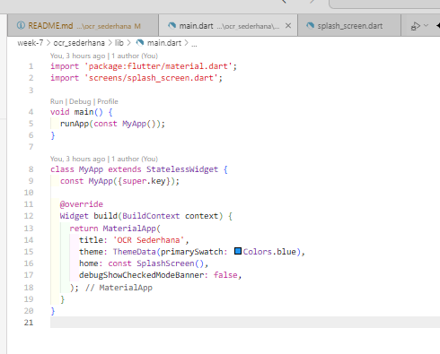

`lib/screens/home_screen.dart`

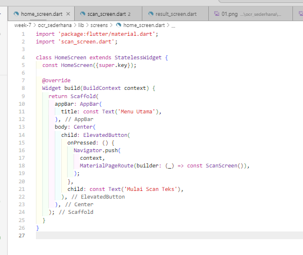

`lib/screens/result_screen.dart`

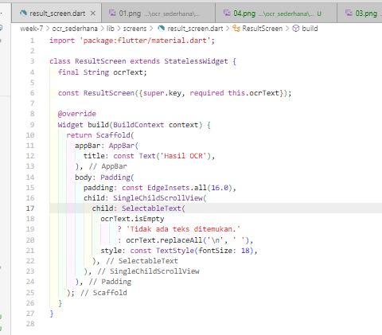

`lib/screens/scan_screen.dart`

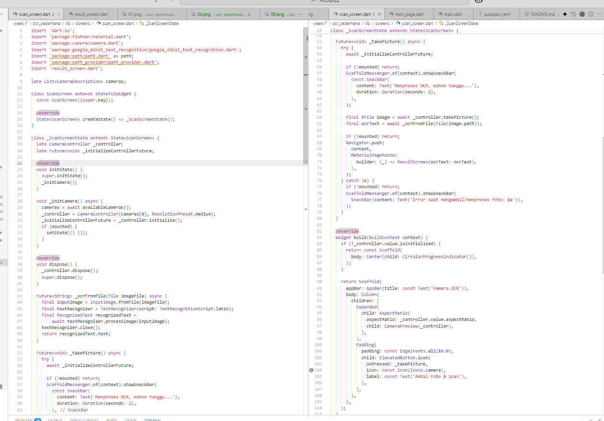

`lib/screens/splash_screen.dart`

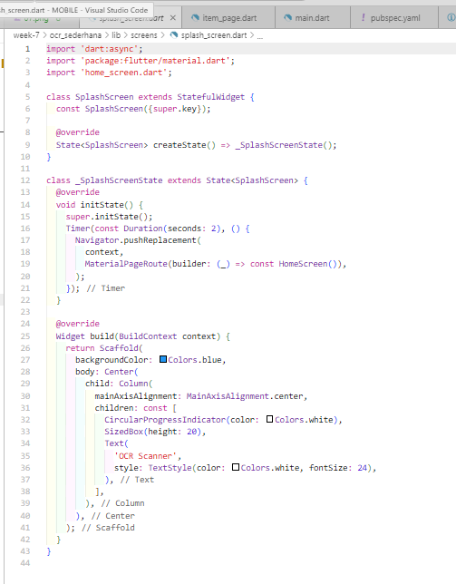

**TUGAS PRAKTIKUM**
1. Jalankan aplikasi di emulator atau HP.
2. Lakukan scan terhadap teks cetak (misal: buku, koran, atau layar HP).
3. Amati hasil OCR yang muncul.
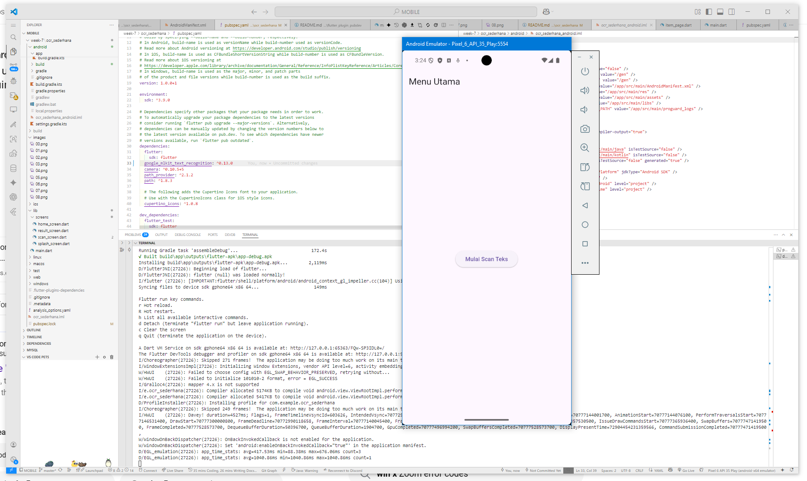
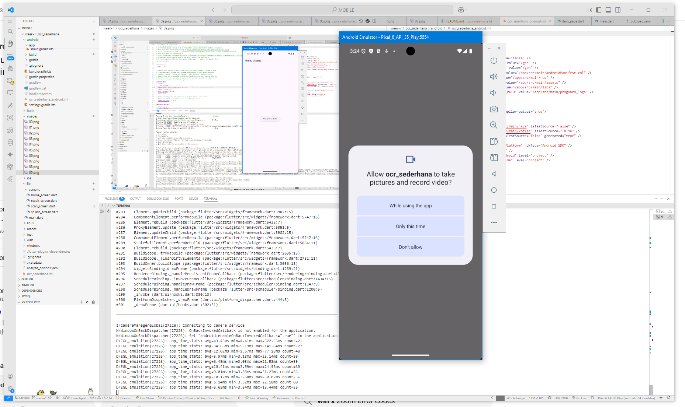
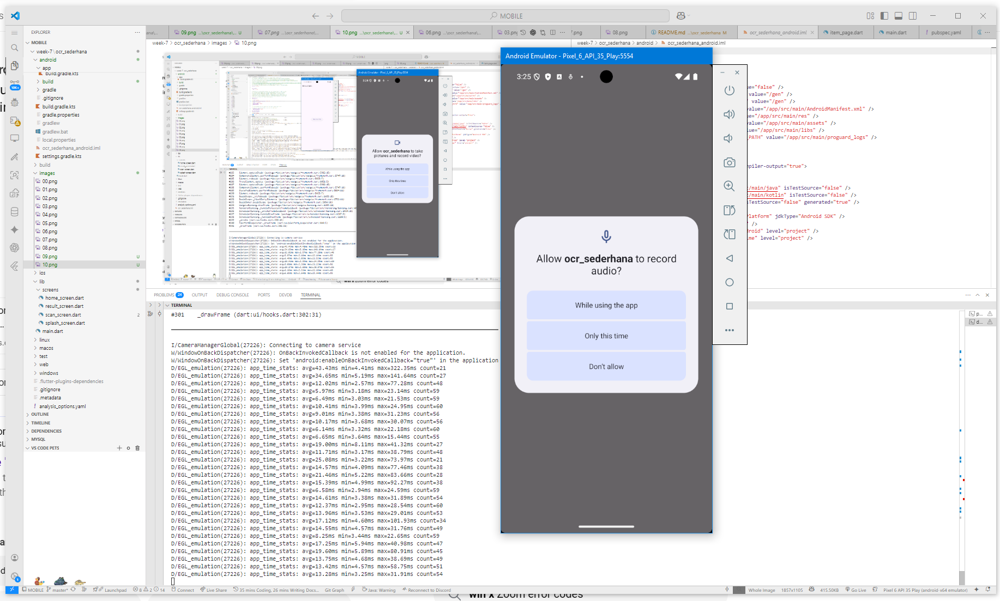
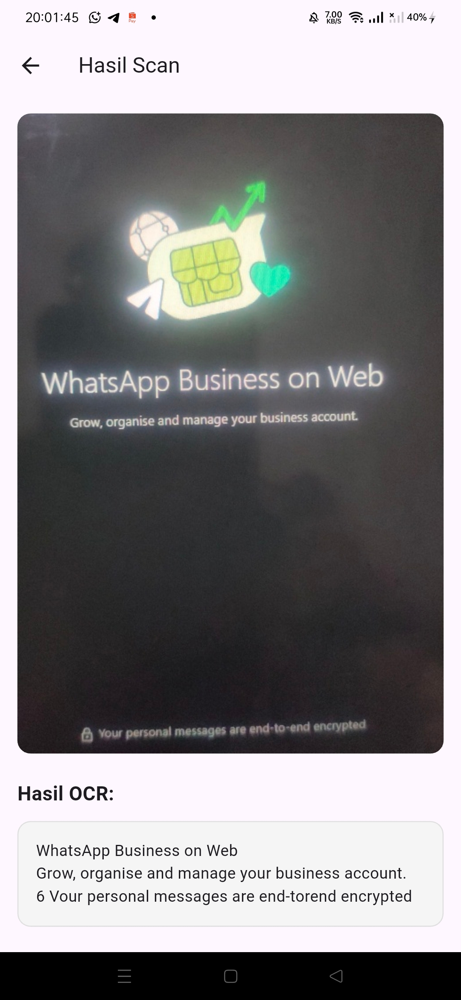
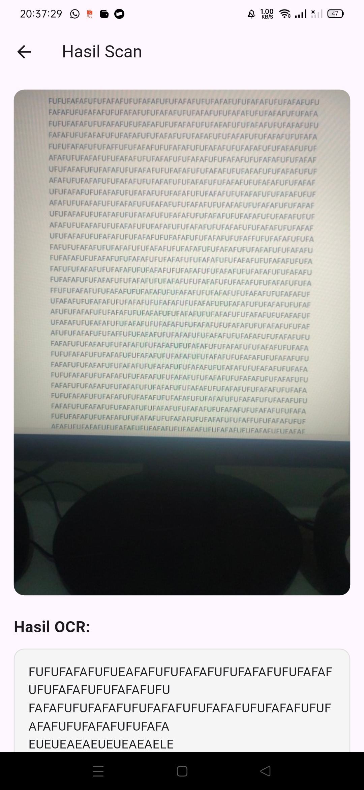

4. Jawab pertanyaan berikut:

a. Apakah semua teks terbaca dengan akurat? Mengapa?

>Dari hasil yang saya uji coba, hasilnya lumayan akurat, ada beberapa miss karena Akurasi hasil OCR sangat dipengaruhi oleh beberapa faktor, seperti kualitas gambar (fokus, pencahayaan, resolusi), jenis dan ukuran font, serta kebersihan latar belakang. Jika gambar buram, terlalu gelap, atau ada banyak noise, maka hasil pembacaan teks bisa kurang tepat atau bahkan salah. Selain itu, teks yang miring, terlalu kecil, atau menggunakan font yang tidak standar juga bisa membuat OCR kesulitan mengenali karakter dengan benar.

b. Apa kegunaan fitur OCR dalam kehidupan sehari-hari?

>Fitur OCR sangat berguna untuk mengubah teks dari gambar atau dokumen fisik menjadi teks digital yang bisa diedit, dicari, atau disimpan. Contohnya, OCR bisa digunakan untuk menyalin tulisan dari buku, nota belanja, kartu nama, atau dokumen penting tanpa harus mengetik ulang secara manual. Dengan OCR, pekerjaan menjadi lebih cepat dan efisien, serta memudahkan digitalisasi dokumen.


c. Sebutkan 2 contoh aplikasi nyata yang menggunakan OCR!

>1.**Google Lens**  
   Aplikasi ini memungkinkan pengguna memindai teks dari gambar, buku, papan tulis, atau dokumen, lalu menyalinnya ke ponsel atau menerjemahkan langsung.

>2.**CamScanner**  
   Aplikasi ini digunakan untuk memindai dokumen fisik menjadi file PDF atau gambar, lalu mengubah teks di dalamnya menjadi teks digital yang bisa dicari dan diedit.

